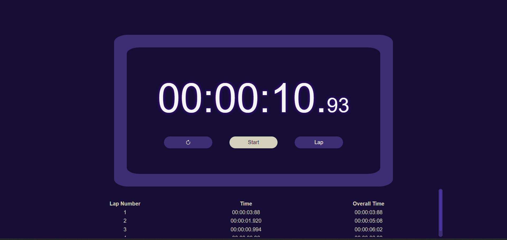
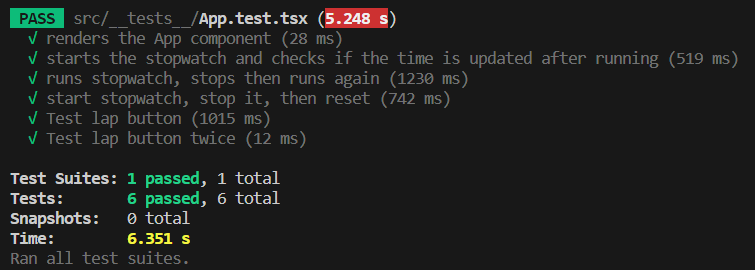

# Project Overview

This project involves the creation of a stopwatch application using React and TypeScript for Shopify's Frontend Technical Challenge. The goal is to implement a fully functional stopwatch with a clean, intuitive UI and robust functionality.




### Features

- [x] **Start**: Start the stopwatch to begin counting time.
- [x] **Stop**: Stop the stopwatch to pause the timer.
- [x] **Lap**: For each lap, displays:
  - [x] Lap Number
  - [x] Time Elapsed from Previous Lap
  - [x] Total Time Elapsed
- [x] **Reset**: Reset the stopwatch to zero.
- [x] **Unit Testing**: Tests the individual components of the stopwatch.
- [x] **Integration Testing**: Testing application's behavior as a whole.

#### Additional Features

- [x] **UI Enchancements**: Bootstrap and custom CSS utilized to create a modern look.
- [x] **Responsive Design through Bootstrap**

## Running the Project

### Prerequisites

- Node.js
- npm

### Setup

1. Clone the repository to your local machine.
2. Install the dependencies:
   ```bash
   npm install
   ```
3. Start the development server:
   ```bash
   npm start
   ```
4. Open hostname in browser to see the stopwatch App.

### Testing
1. Run this command to test:
    ```bash
    npm test
    ```

**Test Results**




## Project Structure

- `src`
  - `src/App.tsx`: The main component for the stopwatch App.
  - `src/components/Stopwatch.tsx`: Component for the stopwatch display.
  - `src/components/StopwatchButton.tsx`: Component for the start, stop, and reset buttons including their feature implementation.
  - `src/components/LapTable.tsx`: Component for table that stores Laps, this includes its functionality implementation.
- `styles`
  - `styles/StopWatch.css`: Includes style definitions for custom styling in addition to Bootstrap.
- `tests`
  - `__tests__/App.test.tsx`: Includes unit and integration tests of application.
  
## Testing

The application was tested to ensure reliability and functionality, while utilizing the React Testing Library.

**Approach**
- **Realistic Interaction**: Tests simulate real user behavior, including clicking buttons and observing subsequent changes in the application's state and UI.
- **Component Integration**: Tests determine how successfully different components of the app interact with each other, ensuring that they work together seamlessly.

**Key Test Cases**
1. **Initial Render**:
   - Verifies that the app renders correctly and that all essential elements (start, lap, reset buttons) are present.

2. **Starting and Updating Stopwatch**:
   - Ensures that the stopwatch starts and updates time correctly upon clicking the start button.

3. **Stopping and Resuming**:
   - Tests the ability to stop the stopwatch and then resume it, ensuring accurate timekeeping throughout.

4. **Reset Functionality**:
   - Confirms that the reset button sets the stopwatch back to zero.

5. **Lap Recording**:
   - Validates the lap functionality, ensuring each lap is recorded correctly.

6. **Multiple Laps**:
   - Checks that multiple laps can be recorded and displayed correctly.

### Testing Strategy

- Each test case uses helper functions like `checkTime` and `checkLapTime` for consistency and readability.
- Asynchronous behavior is handled using `async/await` to accurately test the stopwatch over a period of time.
- The `act` function from React Testing Library wraps actions to ensure that all updates related to these actions are applied before assertions.

