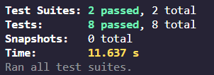

### Project Overview
This is a completed solution to the Shopify react intern assessment. The application is a stopwatch that provides starting, stopping, laps, and reset functionalities. I have added a loading screen for aesthetic purposes. Overall this project was very fun to make and I hope you enjoy using it just as much as I did making it ! Thank you.

### UI Demo

## Instructions to run

### Running the application

To run the application, clone the repository and run "npm install" to ensure all dependencies are installed. Then run npm start to view the application.

### Running the tests

After cloning the repository and installing all dependencies, you can run the tests by runnning "npm test". There are two test files: StopWatch.test.tsx StopWatchButton.test.tsx

You should see similar results to the one below:
 

