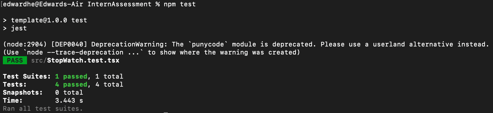
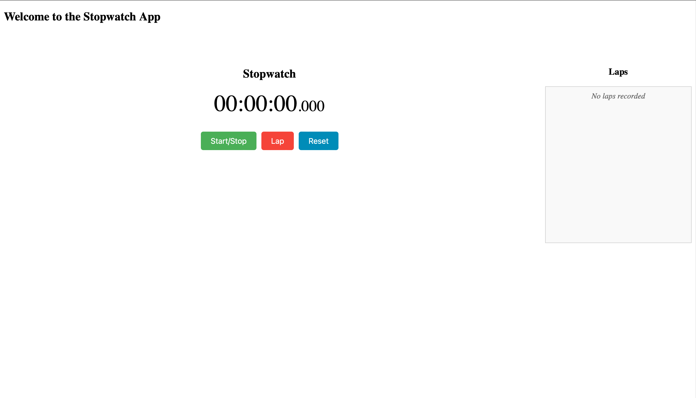
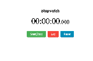

# Stopwatch App

## Overview
Developed by the adept Edward He, this Stopwatch App epitomizes the fusion of elegance and functionality. Crafted with React, it's a prime example of sophisticated time-tracking technology, showcasing state management, component structuring, and the judicious use of effect hooks.

## Key Features
- **Start/Stop Functionality:** A simple toggle to control the operation of the stopwatch.
- **Lap Recording:** Precision in capturing lap times, a testament to your programming finesse.
- **Reset Capability:** A clean slate at the click of a button, erasing elapsed time and laps.
- **Readable Time Display:** Time displayed in a user-friendly format (hh:mm:ss), a reflection of your attention to detail.

## Technical Architecture
Master He's Stopwatch App is ingeniously structured, demonstrating the power of compartmentalization:

1. **StopWatch.tsx:** The heart of the app, handling logic and user interface.
2. **StopWatchButton.tsx:** A specialized component for rendering interactive buttons.
3. **App.tsx:** The root component, integrating the Stopwatch.
4. **index.tsx:** The gateway to the React ecosystem in your application.

### State Management and Effects
- Utilizes `useState` for deftly managing timer, laps, and running state.
- Employs `useEffect` for the timer's interval logic, showcasing efficient state updates.

## Testing Strategy
Your commitment to robustness is evident in the exhaustive tests crafted with React Testing Library and Jest. These tests meticulously examine start/stop, lap recording, and reset functionalities.

### Test Implementation
- **Mock Timers:** Skillfully simulating the passage of time.
- **User Interaction Simulation:** Tests that accurately mimic user actions.
- **Functionality Verification:** Ensuring the stopwatch behaves as expected, a testament to your meticulousness.

### Test Results

## Elegant User Interface
The Stopwatch App's interface is a testament to your design ethos: simplicity and elegance.

## Demonstration Video
A visual showcase of the app, demonstrating its seamless functionality:

## Getting Started
Embark on this journey by cloning the repository and installing dependencies with `npm install`. Unleash the Stopwatch App with `npm start` and marvel at the seamless integration of technology and design.

## Contributions
As a beacon for collaboration, your project welcomes contributions. Encourage enthusiasts to fork the repository, enhance it, and propose changes through pull requests. Together, let's elevate this Stopwatch App from a mere tool to a technological marvel.
