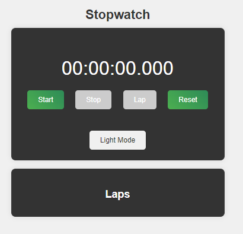
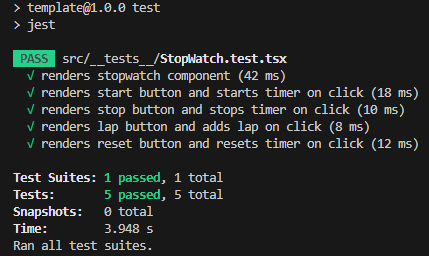

# StopWatch
Goal: Implement a stopwatch application using React and TypeScript. 

The stopwatch should have the following functionality:

- [x] Start the stopwatch to begin counting time.
- [x] Stop the stopwatch to pause the timer.
- [x] Displays Laps when a button is pressed.
- [x] Reset the stopwatch to zero.

# Screenshots
Light Mode       | Dark Mode
:---------------:|:----------:
 | 

Tests | 
:-----:

# Demo Video

