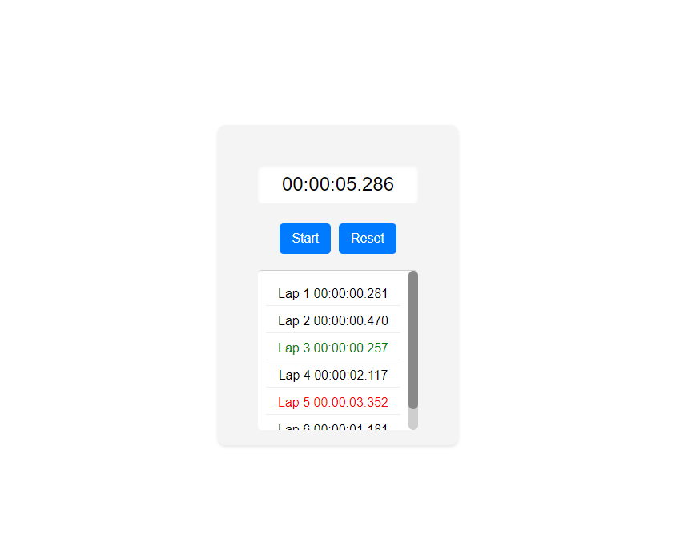

## Decision to Use Context
I introduced WatchContext as a means to manage and distribute the state of the stopwatch throughout the application. This was crucial for a couple of reasons. First, it allowed me to avoid prop drilling, which would have made the codebase more complex and harder to maintain. Second, it enabled any component within the context provider to access and manipulate the stopwatch state, fostering better component reusability and cleaner code.

## General Functionality
Implementing the core functionalities of the stopwatch, such as start, stop, lap, and reset, was a foundational step. I used React's useState and useEffect hooks for managing the time and intervals. 

I created a custom function to format the time for display. The rationale was to convert time in milliseconds to a human-readable format (HH:MM:SS.mmm).

I added the functionality to record individual lap times and determine the slowest and fastest laps. This decision was driven by the desire to make the stopwatch more versatile and useful, particularly for users needing detailed time tracking, such as in sports.

## Testing
I wrote unit tests using Jest for both the components and utility functions such as the format function and lap display/accuracy. My goal here was to ensure code reliability and ease future maintenance. 

## Modularity
I debated between embedding styles directly within components and maintaining them in separate CSS files. Each method has its advantages: Inline styles or CSS-in-JS solutions like styled-components provide better encapsulation, while external CSS files offer a clear separation of concerns. I considered project complexity and a hypothetical collaborative setting in making my choice.

